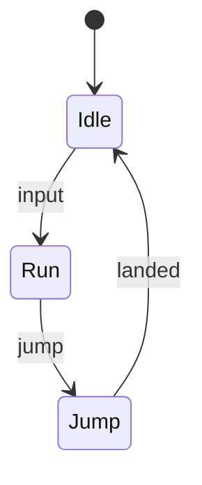

이 글은 `_drafts/`에 있으므로 `bundle exec jekyll serve --drafts` 로만 보입니다.
배포되지 않으니 마음껏 참고용으로 쓰세요.

## 위키 링크와 백링크

Obsidian처럼 `[[글 제목]]`으로 다른 글을 연결합니다: [[GDScript 기초]],
별칭을 붙이면 [[gdscript-annotations|어노테이션 정리]], 특정 헤딩으로는 [[GDScript에서 원하는 노드 찾기#경로를 이용해 찾기]].
없는 글은 이렇게 표시됩니다: [[아직 안 쓴 글]].

링크된 글의 하단에는 **Backlinks** 가 자동으로 생기고, `/graph/` 의 지도에도 선이 그어집니다.

## 콜아웃

> [!NOTE]
> GitHub / Obsidian 문법 그대로 `> [!NOTE]` 로 시작합니다.

> [!TIP] 제목도 바꿀 수 있어요
> `[!TIP]` 뒤에 쓰면 제목이 됩니다.

> [!WARNING]- 접히는 콜아웃
> 타입 뒤에 `-` (닫힘) 또는 `+` (열림)을 붙이면 접을 수 있습니다.

> [!CAUTION]
> `NOTE`, `TIP`, `IMPORTANT`, `WARNING`, `CAUTION`, `BUG`, `EXAMPLE` 등을 지원합니다.

## 코드

```gdscript
extends CharacterBody2D

@export var speed := 240.0

func _physics_process(delta: float) -> void:
    var dir := Input.get_vector("left", "right", "up", "down")
    velocity = dir * speed
    move_and_slide()
```

```cpp
template <typename T>
constexpr T lerp(T a, T b, float t) noexcept {
    return a + (b - a) * t; // inline comment
}
```

인라인 코드는 `move_and_slide()` 처럼 씁니다. 단축키는 <kbd>Ctrl</kbd> + <kbd>K</kbd>.

## 수식 (MathJax)

인라인 수식 $E = mc^2$ 과 블록 수식:

$$
\mathbf{v}_{t+1} = \mathbf{v}_t + \frac{\mathbf{F}}{m}\,\Delta t
$$

> 마크다운이 `_`를 기울임으로 바꾸지 않도록, 아래첨자가 많은 인라인 수식은 `$$...$$` 로 감싸는 것이 안전합니다.

## 다이어그램 (Mermaid)



## 표 · 체크리스트 · 각주

| 엔진 | 언어 | 비고 |
|------|------|------|
| Godot | GDScript, C# | 오픈소스 |
| Unreal | C++, Blueprint | AAA |
| Unity | C# | 에셋 스토어 |

- [x] 프로토타입
- [ ] 레벨 디자인
- [ ] 출시

게임 루프는 보통 고정 시간 간격으로 돈다.[^loop]

[^loop]: Glenn Fiedler, *Fix Your Timestep!*

## 이미지와 영상

이미지는 클릭하면 확대됩니다 (라이트박스).


유튜브: ``

---

## Front matter 레퍼런스

```yaml
title: "제목"
subtitle: "부제 (선택)"
date: 2026-10-01 12:00:00 +0900
categories: devlog          # 하나만, 색과 페이지가 자동으로 생깁니다
tags: [godot, shader]       # 여러 개
series: "My Game Devlog"    # 같은 이름끼리 연재로 묶임
aliases: [별칭]              # [[별칭]] 으로도 링크 가능
pinned: true                # 홈 상단 고정
cover: /assets/img/cover.png
description: "목록/SEO 요약"
last_modified_at: 2026-10-02
math: true                  # 수식 자동 감지가 안 될 때 강제
toc: false                  # 목차 끄기
comments: false             # 댓글 끄기
hidden: true                # 홈/검색에서 숨김
```
